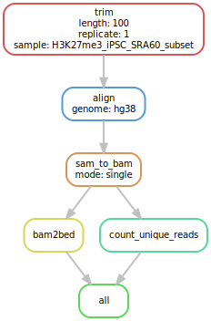

gene mappings
================

- [Mappability Factors Analysis](#mappability-factors-analysis)
  - [Experiment and Analysis:](#experiment-and-analysis)
    - [Analysis](#analysis)
      - [a. Read length](#a-read-length)
      - [b. Reference Genomes](#b-reference-genomes)
      - [c. Alignment Mode](#c-alignment-mode)
  - [Conclusion](#conclusion)

# Mappability Factors Analysis

This analysis is based off an assignment from my genomic class in
undergrad.

Tools used:

- bowtie2
- samtools
- sambamba
- trimmomatic
- liftover
- Snakemake

## Experiment and Analysis:

The goal of this experiment is to explore how various factors can affect
mappability of gene reads to a reference genome.

The following factors were tested:

- **Read Length**: 50bp, 100bp, 500bp

- **Reference Genome:** hg19, hg38

- **Alignment mode:** Paired, Single

For analysis, we need the bed files containing algined reads and the txt
file of the unique reads. The basic Snakemake pipeline is as follows:

1.  Trim reads to appropriate length using trimmomatic
2.  Align sequence reads using single or pair end alignment with bowtie2
3.  Convert the sam file to a bam format for step 5
4.  Convert the bam file to a bed format
5.  Count unique reads using sambamba to get txt file.

To compare the reads mapped to different reference genomes, an
additional step is required to convert hg19 coordinates to hg38 using
ucsc-liftover.

We will need to run this snakemake pipeline for every read length and
reference genome combination. For the alignment mode, we keep all other
factors constant, using hg38 as the reference genome and trimming reads
to a length of 50bp.

``` python
#Snakefile for testing mappability factors

configfile: "config.yaml"
conda_env: "/home/environments/Mappability_Factors"
LENGTH = config["length"]
GENOME = config["genome"]
MODE = config["mode"]

SAMPLES = ["H3K27me3_iPSC_SRA60_subset"]

#all rule
rule all:
    input:
        expand("bed/{sample}_CROP{length}_{genome}_{mode}.bed", length = LENGTH, genome = GENOME, mode = MODE, sample = SAMPLES),
        expand("counts/{sample}_CROP{length}_{genome}_{mode}_nReads.txt",length = LENGTH, genome = GENOME, mode = MODE, sample = SAMPLES),
        expand("aligned/lifted_over_{sample}_CROP{length}_hg38_{mode}.bed", length = LENGTH, genome = GENOME, mode = MODE, sample = SAMPLES) if (GENOME == "hg38" and LENGTH == 50) else []


#for single end alignment
rule align:
    input:
        fastq = "trimmed/{sample}_1_{length}.fastq.gz"
    output:
        sam = "aligned/{sample}_{length}_{genome}_single.sam"
    shell:
        "bowtie2 -x /genome_practice/indexes/{wildcards.genome}/{wildcards.genome}_bowtie2_index "
        "-U {input.fastq} -S {output.sam}"


#for converting sam file to bam file
rule sam_to_bam:
    input:
        sam = "aligned/{sample}_{length}_{genome}_{mode}.sam"
    output: 
        bam = "aligned/{sample}_{length}_{genome}_{mode}.bam"
    shell:
        "samtools view -h -S -b -o {output.bam} {input.sam}"


#converts bam to bed files - asked for in all function and required for liftover
rule bam2bed:
    input:
        "aligned/{sample}_{length}_{genome}_{mode}.bam"
    output:
        "bed/{sample}_CROP{length}_{genome}_{mode}.bed"
    shell:
        "bedtools bamtobed -i {input} > {output}"


#Counts number of uniquely mapped reads in the bam file
rule count_unique_reads:
    input:
        "aligned/{sample}_{length}_{genome}_{mode}.bam"
    output:
        "counts/{sample}_CROP{length}_{genome}_{mode}_nReads.txt"
    shell:
        "sambamba view -c -F "
        "\"[XS] == null and not unmapped and not duplicate\" {input} > {output}"


#trims lengths of reads according to a given variable
rule trim:
    input:
        "/genome_practice/Mappability_Factors/{sample}_{replicate}.fastq.gz"    
    output:
        "trimmed/{sample}_{replicate}_{length}.fastq.gz"
    shell:
        "trimmomatic SE {input} {output} CROP:{wildcards.length}"
        

#different reference genome
rule liftover:
    input:
        "bed/{sample}_CROP{length}_{genome}_{mode}.bed"
    output:
        mapped = "aligned/lifted_over_{sample}_CROP{length}_{genome}_{mode}.bed",
        unmapped = "aligned/lifted_over_{sample}_CROP{length}_{genome}_{mode}_UNMAPPED.bed"
    shell:
        "liftOver {input} /genome_practice/Mappability_Factors/hg19ToHg38.over.chain.gz {output.mapped} {output.unmapped}"      


#deals with paired alignment
rule align_paired:
    input:
        r1="trimmed/{sample}_1_{length}.fastq.gz",
        r2="trimmed/{sample}_2_{length}.fastq.gz"
    output:
        sam = "aligned/{sample}_{length}_{genome}_paired.sam"
    shell:
        "bowtie2 -x /genome_practice/Mappability_Factors/indexes/{wildcards.genome}/{wildcards.genome}_bowtie2_index "
             "-1 {input.r1} -2 {input.r2} -S {output.sam}"
```

Here are some graphs showing workflows for different factors:

<figure>

<figcaption aria-hidden="true">100bp | hg38 | single
alignment</figcaption>
</figure>

<figure>

<figcaption aria-hidden="true">50bp | hg19 | single
alignment</figcaption>
</figure>

<figure>

<figcaption aria-hidden="true">50bp | hg38 | paired
alignment</figcaption>
</figure>

### Analysis

#### a. Read length

With the resulting txt file, let’s plot the number of uniquely mapped
reads for each read length

``` r
library(ggplot2)

length_data <- data.frame(lengths = c(50, 100, 150), unique_count = c(0,
    0, 0))

for (l in length_data$lengths) {
    name = paste("counts/H3K27me3_iPSC_SRA60_subset_CROP", l,
        "_hg38_single_nReads.txt", sep = "")
    length_data$unique_count[which(length_data$lengths == l)] = as.numeric(read.table(name))
}
relation <- lm(unique_count ~ lengths, data = length_data)

ggplot(length_data, aes(x = lengths, y = unique_count)) + geom_point() +
    geom_smooth(method = "lm", se = TRUE) + ggtitle("Read Length vs Unique Mappings")
```


It’s pretty clear that a longer read length results in more unique
mappings. Completely expected, given that every additional base pair
results in 4 new permutations.

The exact function for the linear regression model is as follows:

$$
NumUnqiueReads = 1322063(length) + 1705
$$

Of course, this model might break down outside the \[50, 150\]bp domain.
There’s no guarantee that shorter read lengths would follow this general
trend.

#### b. Reference Genomes

Using the txt again, we can plot the number of unique reads in each
reference genome for reads of length 50 bp.

``` r
# Include the code you used to generate the plot in this
# block. When you knit your document the plot will be
# generated and displayed below.

refgenome_data <- data.frame(genome = c("hg19", "hg38"), unique_count = c(0,
    0))

for (g in refgenome_data$genome) {
    name = paste("counts/H3K27me3_iPSC_SRA60_subset_CROP50_",
        g, "_single_nReads.txt", sep = "")
    refgenome_data$unique_count[which(refgenome_data$genome ==
        g)] = as.numeric(read.table(name))
}

ggplot(data = refgenome_data, aes(genome, unique_count, fill = genome)) +
    geom_col() + ggtitle("reference genome vs unique mappings")
```


There doesn’t look to be a huge difference between the two genomes. hg18
has a few more unique read mappings it seams, but it’s not large enough
to be significant.

Using the bed file, we can check this a bit more in depth. Let’s see if
the reads map to the same location in both genomes, and if the alignment
quality has been affected.

``` r
# making joined dataframe. joined.bed was created by
# merging the 50bp single alignment bed files.
joined = as.data.frame(read.table("files/joined.bed", header = FALSE,
    sep = " ", stringsAsFactors = TRUE))
colnames(joined) = c("read_ID", "chr_hg38", "start_hg38", "end_hg38",
    "score_hg38", "chr_hg19", "start_hg19", "end_hg19", "score_hg19")
```

``` r
# I ran this separately so i could avoid remaking 'joined'
# if necessary. This just removes occurances where the read
# is not on the same chromosome
order = paste0("chr", 1:22)

joined = joined[(joined$chr_hg38 %in% order & joined$chr_hg19 %in%
    order), ]

joined$chr_hg38 = factor(joined$chr_hg38)
joined$chr_hg19 = factor(joined$chr_hg19)

# make sure they are on the same chromosome!
joined = joined[joined$chr_hg19 == joined$chr_hg38, ]

joined$score_difference = joined$score_hg19 - joined$score_hg38
joined_means = aggregate(joined, score_difference ~ chr_hg38,
    "mean")
```

``` r
ggplot(joined_means, aes(x = factor(chr_hg38, levels = order),
    y = score_difference)) + geom_col(position = "dodge") + theme(axis.text.x = element_text(angle = 45,
    hjust = 1)) + ggtitle("mean difference in alignment score between hg19 and hg38") +
    xlab("chromosome") + ylab("mean alignment score difference (hg19 - hg38)")
```


There isn’t much difference between the alignment scores for each
chromosome, with the exception of chromosome 6. In most cases though,
read mapping score is higher in hg19 than in hg38, as there are almost
no negative scores on the chart. (Except chromosome 2). This indicates
that in general, hg19 as a reference results in higher alignment
quality.

This seems a bit counterintutive, since hg38 is widely considered to be
a more accurate reference genome, so it would make more sense if all of
the graph values were negative. It’s possible that the genomic regions
targeted in this particular ChIP-seq experiment are just slightly better
represented in hg19. Though I’m not too certain if a mean alignment
score difference of 2 is even hugely significant.

Lastly, we can check the difference in starting position between the two
genomes for each chromosome.

``` r
joined$start_difference <- (joined$start_hg19 - joined$start_hg38)

ggplot(joined, aes(x = factor(chr_hg38, levels = order), y = start_difference)) +
    geom_boxplot() + theme(axis.text.x = element_text(angle = 45,
    hjust = 1)) + ggtitle("Read starting position per chromosome") +
    xlab("chromosome") + ylab("Difference in starting position (hg19-hg38)")
```


Most of the reads map to the same location in both reference genomes,
and the median and IQRs for each boxplot lies roughly around zero,
appearing as a horizontal line on the graph.

Every chromosome has some outliers to the trend that have significantly
different starting positions, likely due to mapping noise. It’s
noticeable that shorter chromosomes have less difference in starting
position, as the starting positions have less space to move around.

#### c. Alignment Mode

Let’s use a barchart to compare unique mappings between alignment modes.

``` r
mode_data <- data.frame(mode = c("single", "paired"), unique_count = c(0,
    0))

for (m in mode_data$mode) {
    name = paste("counts/H3K27me3_iPSC_SRA60_subset_CROP50_hg38_",
        m, "_nReads.txt", sep = "")
    mode_data$unique_count[which(mode_data$mode == m)] = as.numeric(read.table(name))
}

ggplot(data = mode_data, aes(mode, unique_count, fill = mode)) +
    geom_col() + ggtitle("alignment mode vs unique mappings") +
    ylab("# unique reads")
```


There is a significant increase in unique mappings when using paired end
alignment, about twice that of single end alignment. This is expected,
as mapping from both ends results in a read that is twice as unique.

Though it wasn’t analyzed in this experiment, we can expect the read
length vs uniquely mapped reads graph for paired-end alignment to be
exponential, as increasing read length increases the unique mappability
for both ends in paired-end alignment.

## Conclusion

Let’s put unique mapping into context. How likely is it that a random
read of length $l$ will map to a random genome of length $g$ uniquely?

For a read of length $l$, there are $(4^l)/2$ possible sequences. The
division by two comes from considering the reverse complimentary.

On a genome of length $g$, there are $g+1-l$ possible binding sites for
this random read.

Each of these possible binding regions has a $2/(4^l)$ probability of
matching to the random read, which means there are $2*(g+1-l)/(4^l)$
expected places the read can map to.

To calculate probability of uniqueness, we can use a poisson
distribution. This gives a final answer of:

$$
2(g+1-l)/(4^l) * exp(-2(g+1-l)/(4^l))
$$

if $g$ is a lot larger than $l$, it’s unlikely that the sequence appears
only once in reference. On the flipside, if $g$ is just a few base pairs
longer than $l$, it’s unlikely that the sequence will match at all!

Of course, the genome is not completely random, so this math function
would not quite hold true in a real setting for all read lengths.
Certain regions of the genome are highly repetitive, and depending on
the function of these regions, they could be highly conserved in all
cellular life.

The hg19 reference genome is about 3 billion base pairs long, so for a
random read of length 50, there’s an estimated 4.73e-19 % chance of
there being a unique mapping.

In this analysis, we found that the main factors of read mappability are
read length and alignment mode. Reference genome doesn’t seem to have a
huge effect. Longer read lengths and pair end alignment mode will give
the best results.

However, in the context of a funded experiment, both these factors can
significantly increase the computational and financial costs. If
possible, it would be best to use the minimum read length necessary
(+10% additional), and only use paired end alignment if high quality
mapping is imperative to the study.

It should be noted that reads can also be trimmed based on quality
score, which will be beneficial if the read qualities are good (use
fastQC to check), resulting in longer trimmed reads. Otherwise, if the
read quality does not have high confidence, the reads will be trimmed
shorter. Depending on the application and required mapping quality, this
could be a useful parameter to explore instead of choosing a static
trimmed length.
